### Universidad de San Carlos
### Facultad de Ingeniería
### Redes de computadoras 1
### Sección O
### Carlos Agustín Ché Mijangos
### 201800624
### Segundo semestre 2021

# Manual De Configuración 
El presente proyecto trata sobre la configuración y conexión a una VPN y que los equipos conectados a la VPN puedan comunicarse entre si. 

Se utilizó el servicio de nube de Google Cloud para crear una máquina virtual la cual actúa como conector de VPN para acceder a la red.

Y se instaló un cliente VPN para poder conectarse a la red.

La red creada es la siguiente:
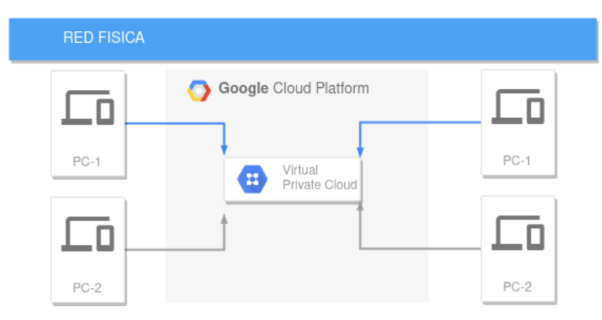

## Herramientas Utilizadas
* Servicio de nube Google Cloud
* Una instancia de VM en la nube google cloud (Sistema Operativo usado Ubuntu)
* Administrador de VPNs OpenVPN
* 2 computadoras físicas
* 2 máquinas virtuales

En este caso las 4 máquinas tienen sistema operativo Windows, pero se puede utilizar cualquier sistema operativo.

## Creación de la instancia en Google Cloud
Al iniciar sesión en Google Cloud, la plataforma incial es la siguiente:
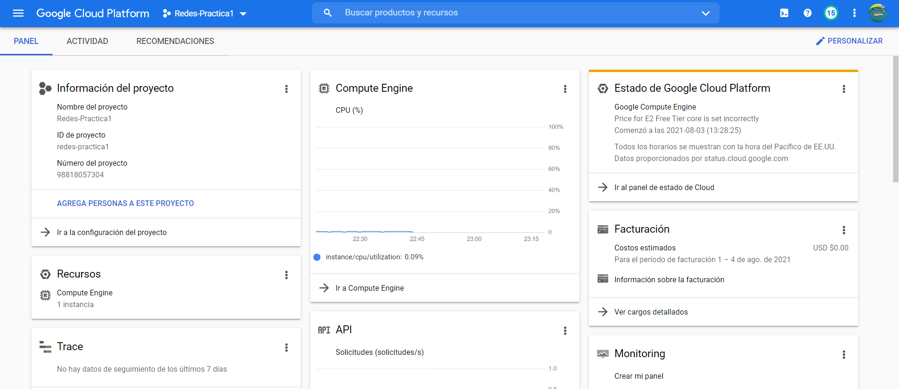

En la barra superior podemos ubicar el nombre del proyecto en cual estamos trabajando

Al dar click se desplegara la siguiente ventana:

para crear un proyecto nuevo, debemos dar click en el boton de proyecto nuevo. 

Se desplegará la siguiente ventana:
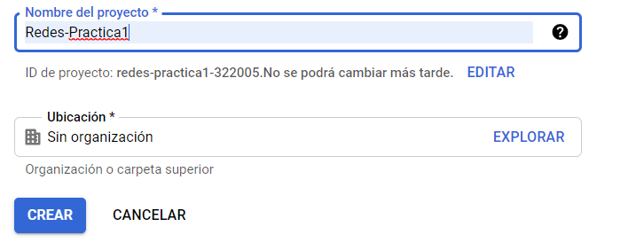
Debemos llenar los campos solicitados y dar click en CREAR.

Al hacer esto se creará un proyecto nuevo y podremos ver el nombre del proyecto en el centro de la barra superior azul en la página de inicio.

Luego debemos desplegar el menú que se encuentra en la barra superior azul, en la esquina izquierda.

Se desplegará el siguiente menú, donde primero debemos seleccionar la opción COMPUTE ENGINE y luego la opción INSTANCIAS DE VM.
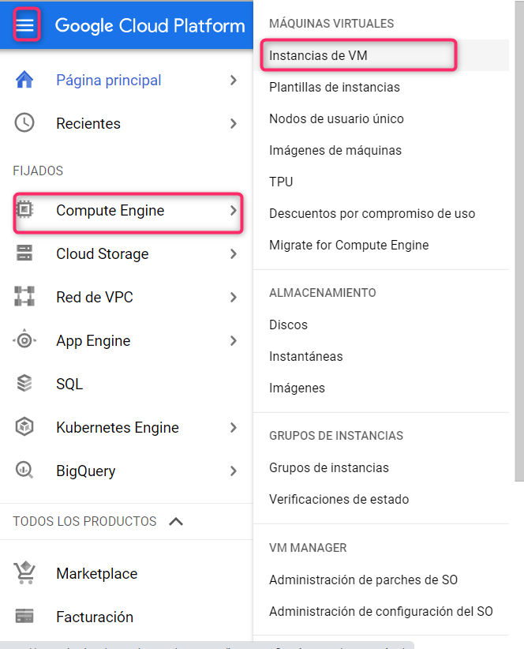

Luego se mostrara la siguiente página en donde debemos seleccionar la opción crear una nueva instancia:
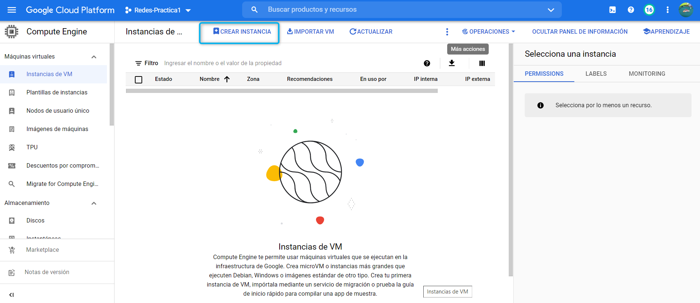

Se desplegará la siguiente páginas, en donde debemos llenar los campos solicitados, en este caso el nombre ingresado fue conector.
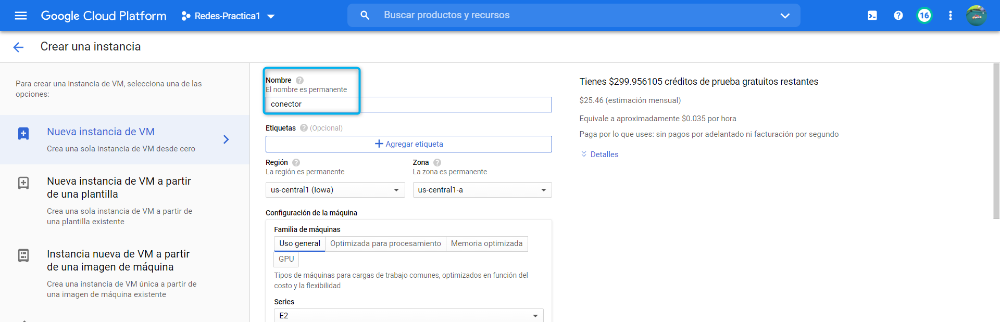

En el tipo de máquina escogemos la opción e2-micro ya que es la opción más barata.
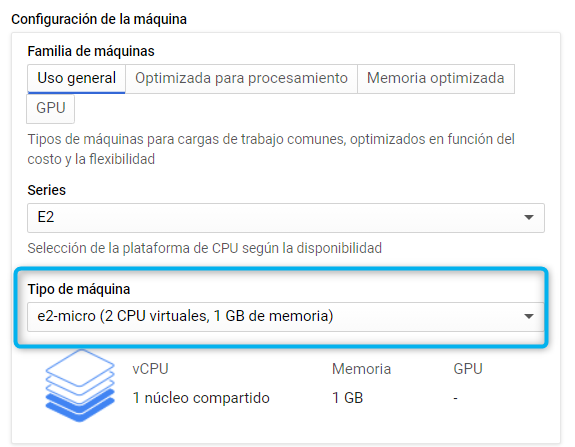

También podemos escoger el sistema operativo deseado, en esta ocasión se escogio el sistema operativo Debian GNU/Linux 10.
Además debemos de seleccionar las opciones de permitir el tráfico HTTP y HTTPS. 
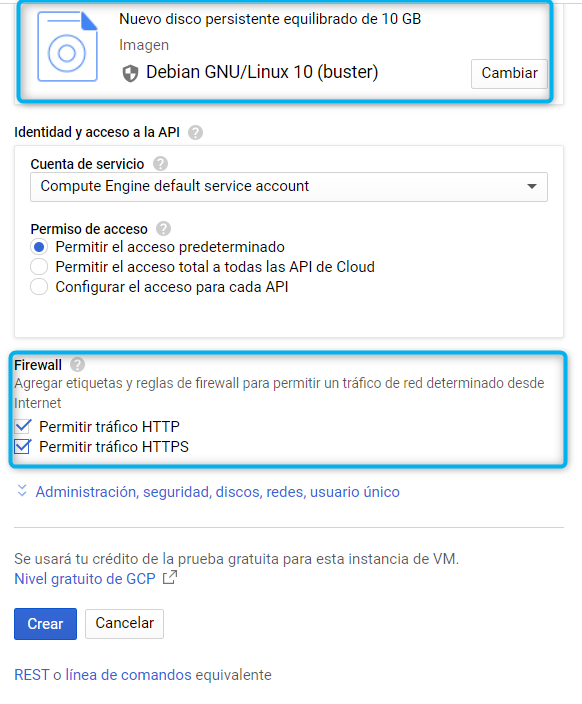
Por último damos click en crear para crear la instancia con las configuracioens dadas, las demás opciones no se modificaron.

A continuación tenemos nuestra instancia creada, y podemos vizualizar y sus detalles en la página de instancias de vm.
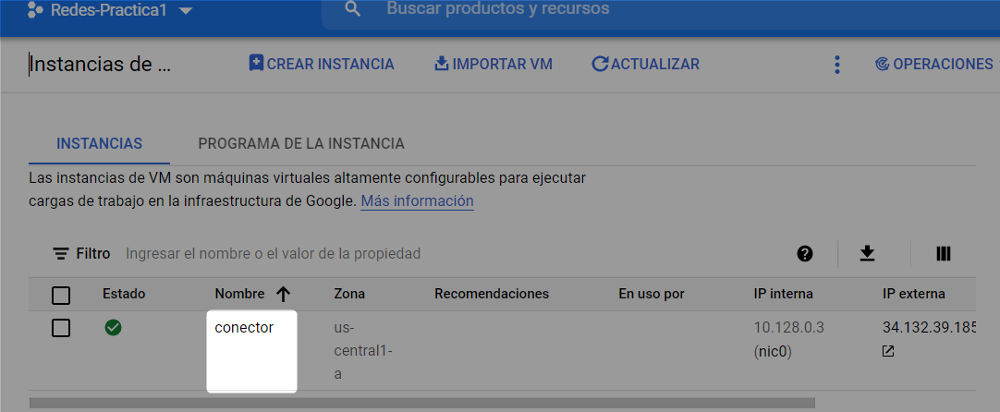

Para poder acceder a la instancia utilizamos la opcion de ssh de google la cual abre la consola de la máquina virtual en el navegador. Solo debemos dar click en la siguiente opción
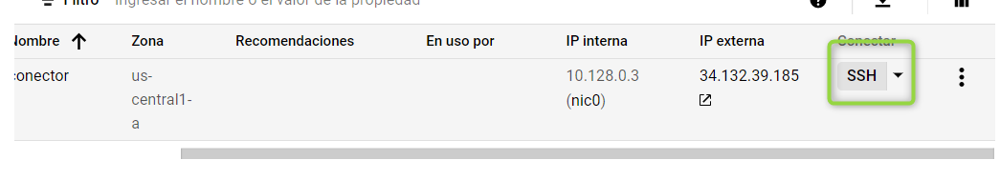

Y la consola de la máquina virtual que se abre en el navegador es la siguiente;
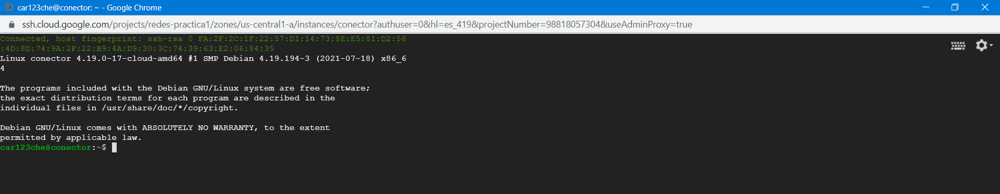

## Anexos 
* [Creación de una cuenta en Google Cloud](https://www.youtube.com/watch?v=UEW-S7pWCiw)
* [Link de descarga de OpenVpn](https://openvpn.net/vpn-client/)
* [Guía para la instalación de OpenVpn](https://www.youtube.com/watch?v=mWZdmPhQeyc)