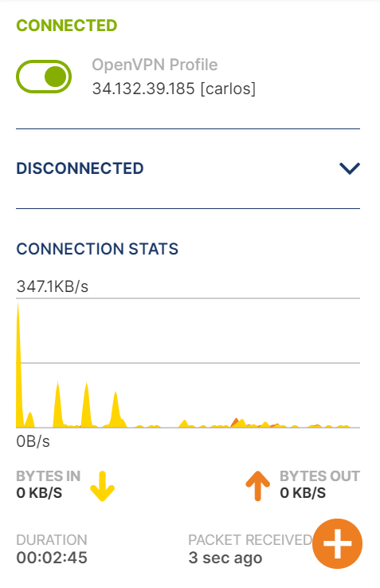

### Universidad de San Carlos
### Facultad de Ingeniería
### Redes de computadoras 1
### Sección O
### Carlos Agustín Ché Mijangos
### 201800624
### Segundo semestre 2021

# Manual De Configuración 
El presente proyecto trata sobre la configuración y conexión a una VPN y que los equipos conectados a la VPN puedan comunicarse entre si. 

Se utilizó el servicio de nube de Google Cloud para crear una máquina virtual la cual actúa como conector de VPN para acceder a la red.

Y se instaló un cliente VPN para poder conectarse a la red.

La red creada es la siguiente:

## Herramientas Utilizadas
* Servicio de nube Google Cloud
* Una instancia de VM en la nube google cloud (Sistema Operativo usado Ubuntu)
* Administrador de VPNs OpenVPN
* 2 computadoras físicas
* 2 máquinas virtuales

En este caso las 4 máquinas tienen sistema operativo Windows, pero se puede utilizar cualquier sistema operativo.

## Creación de la instancia en Google Cloud
Al iniciar sesión en Google Cloud, la plataforma incial es la siguiente:

En la barra superior podemos ubicar el nombre del proyecto en cual estamos trabajando

Al dar click se desplegara la siguiente ventana:

para crear un proyecto nuevo, debemos dar click en el boton de proyecto nuevo. 

Se desplegará la siguiente ventana:

Debemos llenar los campos solicitados y dar click en CREAR.

Al hacer esto se creará un proyecto nuevo y podremos ver el nombre del proyecto en el centro de la barra superior azul en la página de inicio.

Luego debemos desplegar el menú que se encuentra en la barra superior azul, en la esquina izquierda.

Se desplegará el siguiente menú, donde primero debemos seleccionar la opción COMPUTE ENGINE y luego la opción INSTANCIAS DE VM.

Luego se mostrara la siguiente página en donde debemos seleccionar la opción crear una nueva instancia:

Se desplegará la siguiente páginas, en donde debemos llenar los campos solicitados, en este caso el nombre ingresado fue conector.

En el tipo de máquina escogemos la opción e2-micro ya que es la opción más barata.

También podemos escoger el sistema operativo deseado, en esta ocasión se escogio el sistema operativo Debian GNU/Linux 10.
Además debemos de seleccionar las opciones de permitir el tráfico HTTP y HTTPS. 

Por último damos click en crear para crear la instancia con las configuracioens dadas, las demás opciones no se modificaron.

A continuación tenemos nuestra instancia creada, y podemos vizualizar y sus detalles en la página de instancias de vm.

Para poder acceder a la instancia utilizamos la opcion de ssh de google la cual abre la consola de la máquina virtual en el navegador. Solo debemos dar click en la siguiente opción

Y la consola de la máquina virtual que se abre en el navegador es la siguiente;

## Configuración de la instancia virtual de cloud

Al tener nuestra máquina virtual creada en la nube deemos ingresar los siguientes comando en el orden en el que aparecen:

* `sudo apt-get update`
* `sudo apt-get install wget`
* `sudo wget https://cubaelectronica.com/OpenVPN/openvpn-install.sh`

Con esto tenemos el servidor de VPN instaldo el máquina virtual y ahora vamos a proceder a configurarlo.

Primero debemos ingresar el comando:
`sudo bash openvpn-install.sh`

Luego se desplegara la siguiente información en consola, y debemos llenar los campos solicitados:

Podemos ver que primero nos muestra una IP, esta IP es la IP interna de nuestra máquina virtual, luego nos solicita una IP pública o hostname y debemos ingresar la IP externa de nuestra máquina virtual.

Luego se configuraran otros datos adicionales, los cuales se dejaron los default para un mejor rendimiento.

Por último se procedio a crear el primer usuario para la VPN.

Para crear usuarios nuevos lo cuales se puedan conectar a la VPN, debemos de ingresar el comando 
`sudo bash openvpn-install.sh`
luego nos desplagara el menú debemos seleccionar la opción agregar nuevo usuario y llenar los campos solicitados de la siguiente manera:

De esta manera creamos los 4 usuarios con los siguientes nombres:

* carlos
* clientedos
* clientetres
* clientecuatro

Y para poder acceder a la VPN desde nuestros equipos debemos descargar los archivos .ovpn los cuales son las claves de los usuarios y con estas podemos acceder desde la interfaz del programa OpenVPN client.

Para descargar los archivos debemos ingresar los siguientes comandos en consola:

* `cd ..`
* `sudo -i`
* `cp clientedos.ovpn /home/`
* `cp clientetres.ovpn /home/`
* `cp clientecuatro.ovpn /home/`

Con esto hemos copiado los archivos de clientedos, clientetres, clientecuatro al hombe para asi poder descargarlos posteriormente, el archivo carlos.ovpn al ser el primero creado ya se encontraba en el home. 

Para poder descargar los archivos accedemos al menu que se despliega al seleccionar la tuerca en la esquina superior derecha y le damos click en la ocpión descargar

Por útlimo se mostrar la siguiente ventana en donde debemos ingresar la ruta del archivo a descargar en este caso la ruta y el archivo son /hombe/carlos.ovpn

Realizar el paso anterior con los otros tres archivos de las claves de los clientes.

## Configuración de la herramienta de VPN
Para poder realizar la conexión a la VPN abrimos la aplicación de OpenVPN Connect. Vamos a la opcion de FILE y damos click en Browse para buscar el archivo con la clave para el usuario.

Al tener la clave cargada aparecera la siguiente ventana y damos click en conectar

Al estar conectados se mostrará la siguiente interfaz

Para verificar la conexión a la VPN vamos ala página de cual es mi IP y podemos observar que la IP que muestra es la misma IP pública de nuestra máquina virtual

La conexión para los demás máquina y en los otros usuarios es la misma, solo se debe escoger la clave del cliente que se desea al momento de buscar el archivo .ovpn

## Red Privada

## Anexos 
* [Creación de una cuenta en Google Cloud](https://www.youtube.com/watch?v=UEW-S7pWCiw)
* [Link de descarga de OpenVpn](https://openvpn.net/vpn-client/)
* [Guía para la instalación de OpenVpn](https://www.youtube.com/watch?v=mWZdmPhQeyc)